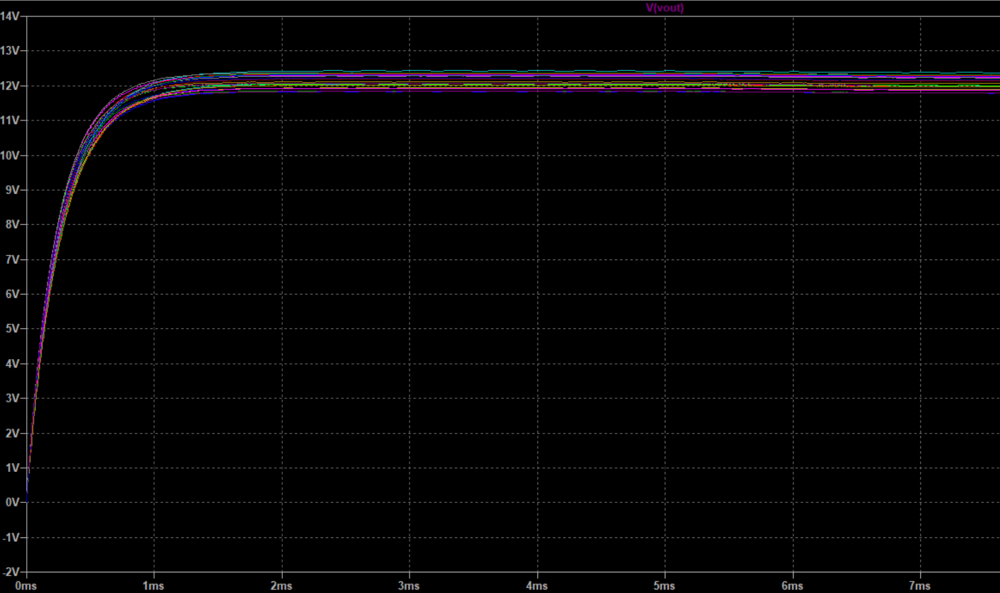
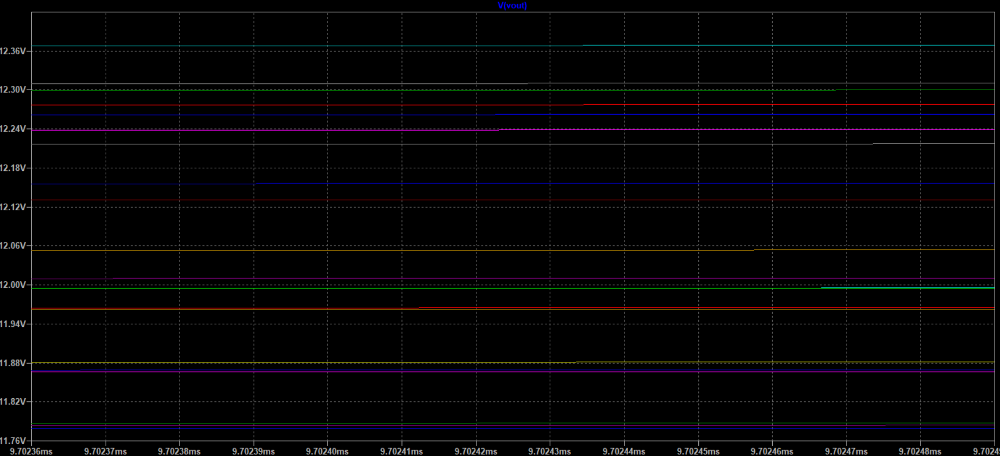

# Simulating a Phase Shifted Full Bridge with LTspice and Monte Carlo Analysis
## Introduction
The phase shifted full bridge is a popular topology for high-power DC-DC conversion applications due to its high efficiency and soft-switching capabilities. Accurately simulating the behavior of this converter is crucial for successful hardware implementation. In this article, we'll walk through the process of setting up a phase shifted full bridge simulation in LTspice and performing a Monte Carlo analysis to assess the impact of component variations.
## Circuit Design
he phase shifted full bridge converter consists of four power switches arranged in a full bridge configuration. The switches are driven with a phase-shifted PWM scheme to achieve soft-switching. For our simulation, we'll use the following circuit parameters:

Input voltage: 400 V 

Output voltage: 12 V

Output power: 700 W

Switching frequency: 150 kHz

The schematic for the phase shifted full bridge converter in LTspice is shown below:

## Monte Carlo Analysis
To evaluate the performance of the phase shifted full bridge under component variations, we'll run a Monte Carlo simulation in LTspice. This analysis randomly varies the values of specific components within a specified range and calculates the resulting circuit performance.

## Result
The simulated output voltage distribution might reveal that the converter is susceptible to large voltage deviations due to component variations. This information can then be used to determine appropriate voltage regulation strategies or guide the selection of more tightly-specified components.

Similarly, the efficiency distribution can help assess the potential impact of component variations on the overall system performance and guide the design of the thermal management system.
