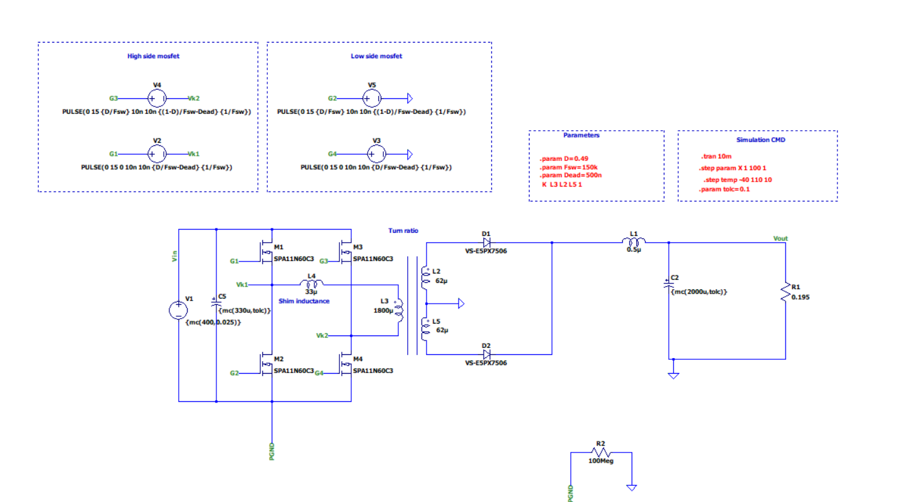

# Simulating a Phase Shifted Full Bridge with LTspice and Monte Carlo Analysis
## Introduction
The phase shifted full bridge is a popular topology for high-power DC-DC conversion applications due to its high efficiency and soft-switching capabilities. Accurately simulating the behavior of this converter is crucial for successful hardware implementation. In this article, we'll walk through the process of setting up a phase shifted full bridge simulation in LTspice and performing a Monte Carlo analysis to assess the impact of component variations.
## Circuit Design
he phase shifted full bridge converter consists of four power switches arranged in a full bridge configuration. The switches are driven with a phase-shifted PWM scheme to achieve soft-switching. For our simulation, we'll use the following circuit parameters:

Input voltage: 400 V 
Output voltage: 48 V
Output power: 700 W
Switching frequency: 150 kHz

The schematic for the phase shifted full bridge converter in LTspice is shown below:

